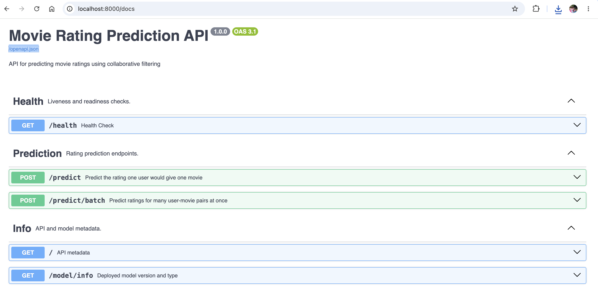
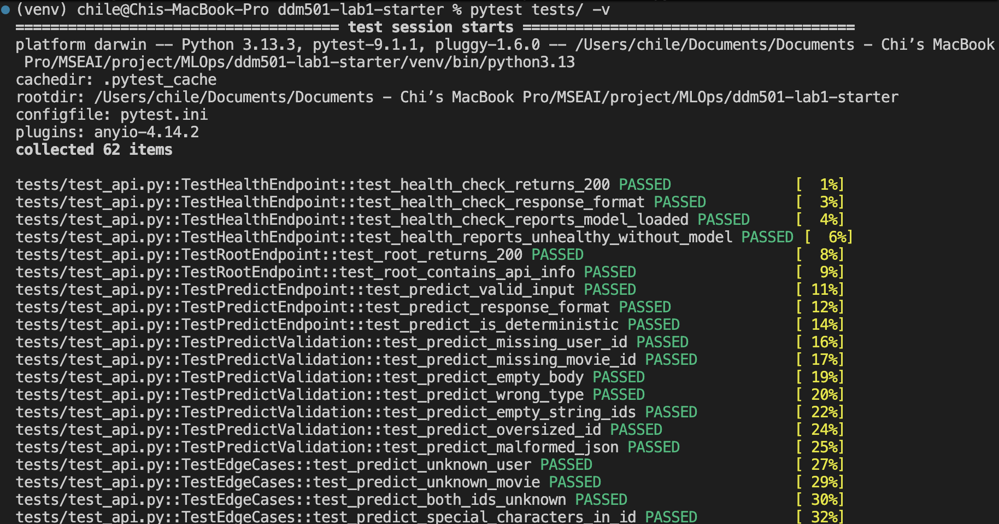
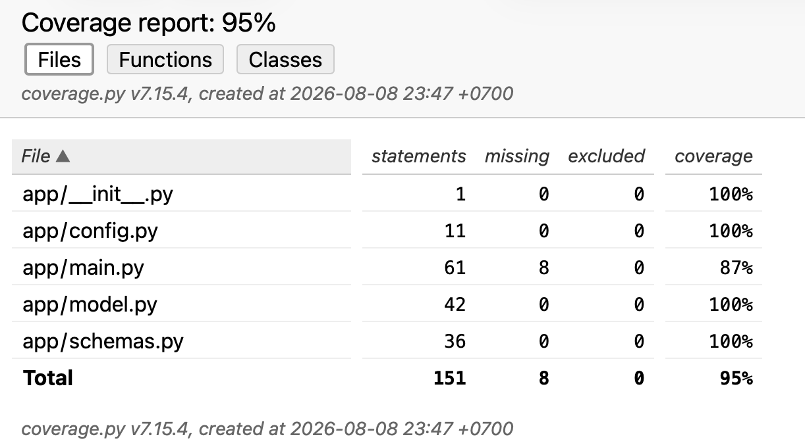
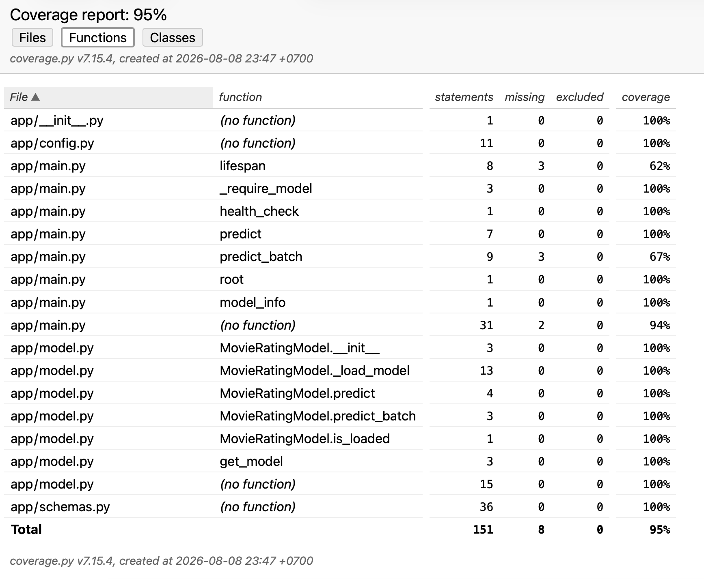
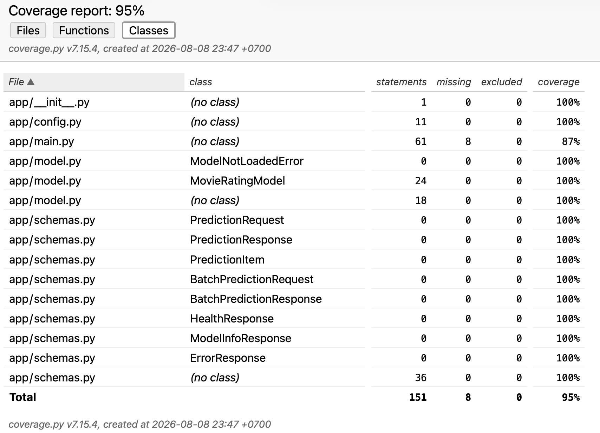

# Movie Rating Prediction API

**Subject:** DDM501 - Lab 1: First ML Product
## General Information

**Lecturer**: Huynh Cong Viet Ngu

**Nhóm**: Nhóm 3 
 
**Member List**
 
| Full name | MSSV | Role |
|--------|------|---------|
| Lê Thị Kim Chi | 25MS23290 | Team lead |
| Trương Quốc Khánh | 25MS23285 | Member |
| Trương Sỹ Quảng | 25MS23286 | Member  |
| Nguyễn Việt Anh Minh | 25MS23275 | Member |
 
---
## Lab Overview 

A production-style REST API that serves a collaborative-filtering model
predicting the rating (1.0-5.0) a given user would give a given movie.

The model is a **Matrix Factorization (SVD)** recommender from the
[Surprise](https://surpriselib.com/) library, trained on the
**MovieLens 100K** dataset (100,000 ratings from 943 users on 1,682 movies).
It is wrapped in a **FastAPI** service, containerized with **Docker**, and
covered by a **pytest** suite.

---

## Features

- **`POST /predict`** - rating prediction for a single user-movie pair
- **`POST /predict/batch`** - up to 100 pairs in one round trip
- **`GET /health`** - health probe reporting whether the model is loaded
- **`GET /model/info`** - deployed model version and algorithm
- **Interactive docs** - Swagger UI at `/docs`, ReDoc at `/redoc`, generated
  from the code with request/response examples on every schema
- **Input validation** - Pydantic rejects empty, oversized and malformed IDs
  with `422` before the model is ever called
- **Graceful degradation** - unknown user or movie IDs fall back to the global
  mean instead of erroring; a missing model yields `503`, never a crash
- **Model loaded once at startup** - unpickling dominates prediction cost, so
  it happens in the app lifespan rather than per request
- **Container health check** - inspects the response body, so a container
  running without a model is correctly marked `unhealthy`

---

## Prerequisites

| Requirement | Version |
|---|---|
| Python | 3.10+ |
| Docker + Docker Compose | any recent version |
| Git | any |

---

## Project Structure

```
ddm501-lab1-starter/
├── app/
│   ├── __init__.py
│   ├── main.py             # FastAPI application & endpoints
│   ├── model.py            # MovieRatingModel wrapper (load / predict / batch)
│   ├── schemas.py          # Pydantic request & response models
│   └── config.py           # Environment-driven configuration
├── models/
│   └── svd_model.pkl       # Trained SVD model (committed)
├── scripts/
│   └── train_model.py      # Trains & saves the model
├── tests/
│   ├── __init__.py
│   ├── test_api.py         # API / integration tests
│   └── test_model.py       # Unit tests for the model wrapper
├── Dockerfile
├── docker-compose.yml
├── .dockerignore
├── pytest.ini
├── requirements.txt
└── README.md
```

---

## Implemetantion Guide

### 1. Clone and set up the environment

```bash
git clone https://github.com/chile87/ddm501-lab1-starter.git
cd ddm501-lab1-starter

# Create virtual environment
python -m venv venv
source venv/bin/activate     # Linux/macOS
# venv\Scripts\activate      # Windows

# Install dependencies
pip install -r requirements.txt
```

### 2. Prepare & Train the Model

```bash
python scripts/train_model.py
```

This will:
- Download MovieLens 100K dataset (100,000 ratings from 943 users on 1,682 movies)
- Train an SVD model using the Surprise library
- Runs 5-fold cross-validation (printing RMSE and MAE)
- Save the trained model to `models/` directory

Note: The trained model is committed at `models/svd_model.pkl`, so the API runs
straight away. 

### 3. Run the API
Run FastAPI development server:

```bash
uvicorn app.main:app --reload --host 0.0.0.0 --port 8000
```
Access Swagger UI: <http://localhost:8000/docs>.



### 4. Test the API

```bash
# Health check
curl http://localhost:8000/health

# Get prediction
curl -X POST "http://localhost:8000/predict" \
  -H "Content-Type: application/json" \
  -d '{"user_id": "196", "movie_id": "242"}'
```

### 5. Run with Docker

```bash
docker compose up -d --build

# Wait for the health check to go green
docker compose ps

# Access API
curl http://localhost:8000/health

# Logs
docker compose logs -f api

# Stop
docker compose down
```

The compose file maps port `8000`, bind-mounts `./models` read-only, and sets
`MODEL_PATH`. The container is marked `healthy` only once the model is loaded.

### 6. Run Test

```bash
# Run all tests
pytest tests/ -v

# With coverage
pytest tests/ -v --cov=app  --cov-report=term-missing

# HTML coverage report -> htmlcov/index.html
pytest tests/ -v --cov=app --cov-report=html
```

**62 tests, all passing, 95% statement coverage of `app/`.**

| File | Scope |
|---|---|
| `tests/test_model.py` | Model loading (missing file, corrupted pickle, wrong object), rating scale, rounding, determinism, unknown IDs, batch consistency, singleton reuse |
| `tests/test_api.py` | Happy paths, input validation, edge cases (unknown/unicode/injection-like IDs), `503` and `500` handling, batch size limits and ordering, OpenAPI schema completeness |

Tests can also be run inside the container:

```bash
docker compose exec api pytest tests/ -v
```
---




## API Usage

| Method | Endpoint | Description |
|---|---|---|
| `GET` | `/` | API metadata and links |
| `GET` | `/health` | Health check - is the model loaded? |
| `POST` | `/predict` | Rating for one user-movie pair |
| `POST` | `/predict/batch` | Ratings for many pairs (max 100) |
| `GET` | `/model/info` | Model version and type |
| `GET` | `/docs` | Swagger UI |
| `GET` | `/redoc` | ReDoc |

### Request/Response Examples

**Health Check:**

```bash
curl http://localhost:8000/health
```

```json
{ "status": "healthy", "model_loaded": true }
```

**Single Prediction:**

```bash
curl -X POST "http://localhost:8000/predict" \
  -H "Content-Type: application/json" \
  -d '{"user_id": "196", "movie_id": "242"}'
```

```json
{
  "user_id": "196",
  "movie_id": "242",
  "predicted_rating": 3.64,
  "model_version": "1.0.0"
}
```

**Batch Prediction:**

```bash
curl -X POST "http://localhost:8000/predict/batch" \
  -H "Content-Type: application/json" \
  -d '{
        "predictions": [
          {"user_id": "196", "movie_id": "242"},
          {"user_id": "186", "movie_id": "302"}
        ]
      }'
```

```json
{
  "predictions": [
    { "user_id": "196", "movie_id": "242", "predicted_rating": 3.64, "model_version": "1.0.0" },
    { "user_id": "186", "movie_id": "302", "predicted_rating": 3.72, "model_version": "1.0.0" }
  ],
  "total_count": 2
}
```

**Model Info:**

```bash
curl http://localhost:8000/model/info
```

```json
{
  "model_version": "1.0.0",
  "model_type": "SVD (Collaborative Filtering)",
  "is_loaded": true
}
```

### Error Responses

| Status | When | Body |
|---|---|---|
| `422` | Missing, empty, oversized or wrong-typed field; batch over 100 items | FastAPI validation detail |
| `500` | Unexpected failure inside the model | `{"detail": "..."}` |
| `503` | Model not loaded | `{"detail": "Model not loaded"}` |

```bash
# Missing movie_id -> 422
curl -i -X POST "http://localhost:8000/predict" \
  -H "Content-Type: application/json" \
  -d '{"user_id": "196"}'
```

**Note on unknown IDs:** a user or movie the model has never seen is *not* an
error. SVD falls back to the global mean, so the request returns `200` with a
valid rating in the 1.0-5.0 range.

---

## Configuration

All settings are environment variables with sensible defaults
(see `app/config.py`):

| Variable | Default | Description |
|---|---|---|
| `MODEL_PATH` | `models/svd_model.pkl` | Path to the pickled model |
| `MODEL_VERSION` | `1.0.0` | Version reported in responses |
| `HOST` | `0.0.0.0` | Bind address |
| `PORT` | `8000` | Bind port |
| `DEBUG` | `false` | Debug flag |

---

## API Documentation

FastAPI generates OpenAPI docs from the source. Every endpoint has a docstring,
every Pydantic model carries an example, and error responses are declared, so
Swagger UI is usable without reading the code:

- Swagger UI: <http://localhost:8000/docs>
- ReDoc: <http://localhost:8000/redoc>
- Raw schema: <http://localhost:8000/openapi.json>

---

## Notes

- `scikit-surprise` 1.1.3 imports `pkg_resources` at runtime, which
  `setuptools` removed in version 81. `requirements.txt` pins `setuptools<81`
  for this reason; the resulting `UserWarning` is harmless.
- The Docker image installs `gcc`/`g++` because `scikit-surprise` compiles its
  Cython extensions from source at install time.
